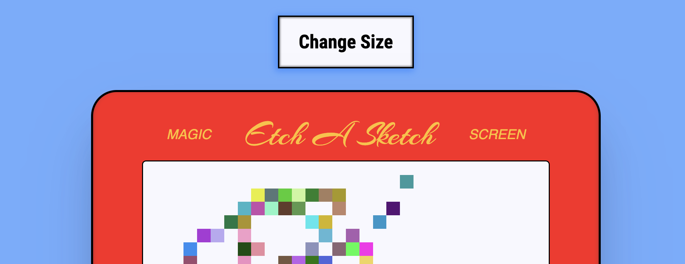

# etch-a-sketch

This is a solution to the [Etch-A-Sketch challenge from The Odin Project](https://www.theodinproject.com/lessons/foundations-etch-a-sketch).

## Table of contents

- [Overview](#overview)
  - [The challenge](#the-challenge)
  - [Screenshot](#screenshot)
  - [Links](#links)
- [My process](#my-process)
  - [Built with](#built-with)
  - [What I learned](#what-i-learned)
  - [Continued development](#continued-development)

## Overview

### The challenge

Create a webpage with a 16x16 grid of divs. The divs should:

- be created using Javascript
- increase or decrease in amount by using a button and user input. the divs should take up the same amount of space regardless of count. 
- change background color to black upon hover
- extra credit: change background color to a random RGB on hover

### Screenshot

Here's the desktop view

### Links

- Solution URL: [solution](https://github.com/importvince/etch-a-sketch)
- Live Site URL: [live site](https://importvince.github.io/etch-a-sketch/)

## My process

### Built with

- Semantic HTML5 markup
- CSS Grid
- Javascript

### What I learned

1. How to pick a project up after a long delay (6 months)

2. How to use a function to delete children elements that were created in another function. I learned the hard way that you can't call these by the locally scoped variable of the other function, you have to iterate through the children elements one by one by checking if they exist and then deleting them if they do. 

3. How to capture the return of a function by using a global variable. 

4. How to capture a mouse hover event

### Continued development

This was my first time back after a long pause due to starting a new job earlier this year. the longer I waited, the harder this project seemed in my mind. Especially because I overcomplicated it before. This time, I stuck to the exact instructions and utilized ChatGPT for the first time. It helped me pick things up where I left off and explain the concepts I knew, but had slightly forgotten. My plan from here is to finally complete The Odin Project and learn React JS. 

## Acknowledgments

Thank you to my girldfriend for inspiring me to pick this skill back up. 

